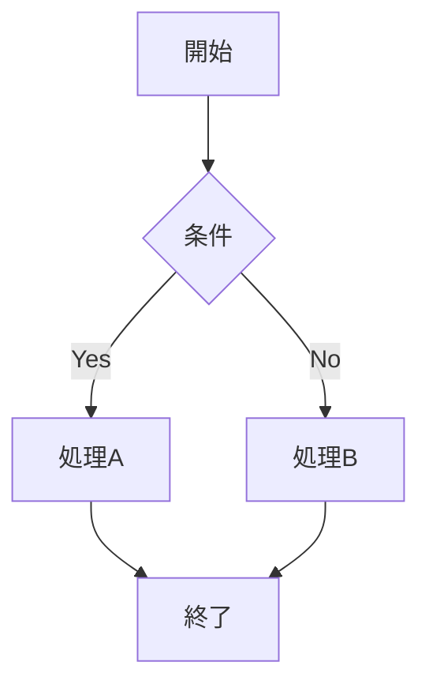
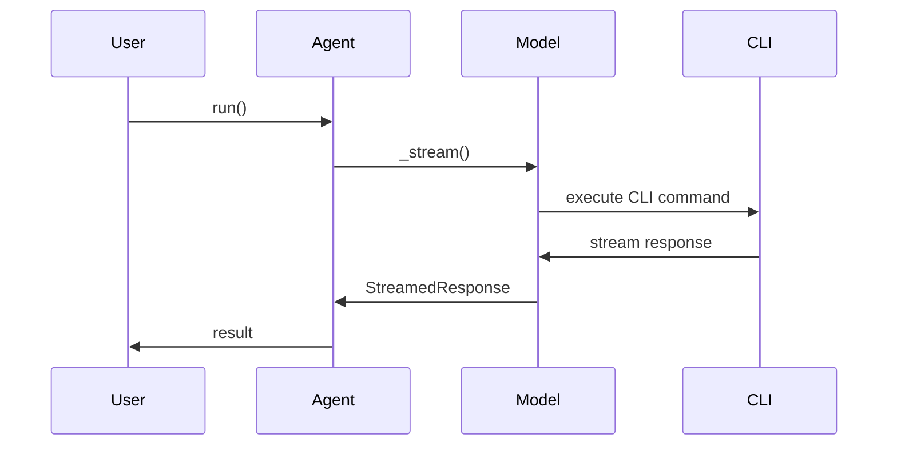
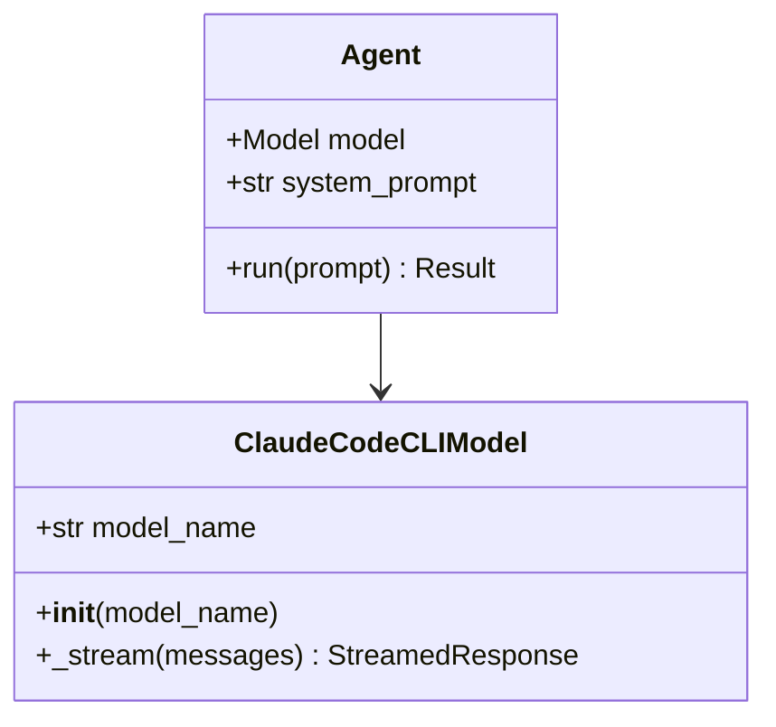

# Sphinxドキュメント作成ガイドライン

このドキュメントは、`pydantic-claude-cli`プロジェクトのSphinxドキュメントを作成・更新する際のガイドラインです。

## MyST構文

このプロジェクトは[MyST (Markedly Structured Text)](https://mystmd.org/guide)を使用します。

### 基本構文

**見出し**:
```markdown
# レベル1見出し
## レベル2見出し
### レベル3見出し
```

**リスト**:
```markdown
- 箇条書き項目1
- 箇条書き項目2
  - ネストされた項目

1. 番号付きリスト項目1
2. 番号付きリスト項目2
```

**強調**:
```markdown
**太字** - 本当に重要な場合のみ使用
*斜体* - 技術用語の初出時など
`コード` - 変数名、関数名、コマンド
```

### Sphinxディレクティブ

**toctree（目次）**:
```markdown
```{toctree}
:caption: 目次
:maxdepth: 2

how-it-works
architecture
comparison-with-pydantic-ai
custom-tools-explained
` ``
```

**注記ボックス**:
```markdown
```{note}
これは注記です。
` ``

```{warning}
これは警告です。
` ``

```{important}
これは重要事項です。
` ``
```

**コードブロック**:
```markdown
```python
from pydantic_ai import Agent
from pydantic_claude_cli import ClaudeCodeCLIModel

model = ClaudeCodeCLIModel('claude-haiku-4-5')
agent = Agent(model)
` ``
```

## トーンとスタイル

### 避けるべき誇張表現

❌ **使わない**:
- 「革命的な」
- 「画期的な」
- 「最高の」
- 「完璧な」
- 「圧倒的な」

✅ **推奨**:
- 「効率的な」
- 「シンプルな」
- 「柔軟な」
- 「信頼性の高い」

### 技術文書のトーン

**良い例**:
```markdown
ClaudeCodeCLIModelは、Claude Code CLIを介してClaudeモデルにアクセスします。
APIキーが不要なため、ローカル開発環境での利用が簡単です。
```

**悪い例**:
```markdown
ClaudeCodeCLIModelは革命的なモデルで、APIキーが一切不要という画期的な仕組みを採用！
これまでにない圧倒的な利便性を提供します。
```

### 強調の使い方

強調（太字）は**本当に重要な情報のみ**に使用します。

**良い例**:
```markdown
**重要**: この機能を使用するには、事前に `claude login` を実行する必要があります。
```

**悪い例**（過度な強調）:
```markdown
**ClaudeCodeCLIModel**は**APIキー不要**で**簡単**に**Claude**にアクセスできます。
```

## コードブロック

### シンタックスハイライター

適切な言語を指定します：

```markdown
```python
# Pythonコード
` ``

```bash
# Bashコマンド
uv run python script.py
` ``

```json
{
  "key": "value"
}
` ``

```toml
[tool.ruff]
line-length = 119
` ``
```

### よくあるエラーと対処法

#### 1. TOMLでの `null` 使用

❌ **エラーになる**:
```toml
key = null
```

✅ **正しい方法**:
```toml
# key = "value"  # 必要に応じてコメントアウト
```

#### 2. JSONでの省略記号

❌ **エラーになる**:
```json
{
  "items": [
    "item1",
    ...
  ]
}
```

✅ **正しい方法**:
```json
{
  "items": [
    "item1",
    "item2",
    "item3"
  ]
}
```

または、完全な例を示せない場合は`text`を使用：
```text
{
  "items": ["item1", ...]
}
```

#### 3. 未サポートの言語

❌ **エラーになる**:
```unknown-lang
some code here
```

✅ **正しい方法**:
```text
some code here
```

または、最も近い言語を使用：
```bash
some command here
```

#### 4. 特殊文字

矢印記号などの特殊文字は避けるか、Unicode文字を使用：

❌ **問題が起きる可能性**:
```python
result → output
```

✅ **推奨**:
```python
# 処理結果を output に格納
result = process()
output = result
```

### 実行可能なコード例

コード例は必ず**完全で実行可能**なものを提供します：

**良い例**:
```python
from pydantic_ai import Agent
from pydantic_claude_cli import ClaudeCodeCLIModel

# モデルを作成
model = ClaudeCodeCLIModel('claude-haiku-4-5')

# エージェントを作成
agent = Agent(model, system_prompt='あなたは親切なアシスタントです。')

# 実行
result = await agent.run('こんにちは！')
print(result.data)
```

**悪い例**（不完全）:
```python
# モデルを作成
model = ClaudeCodeCLIModel(...)
# 使う
result = agent.run(...)
```

## Mermaid図

アーキテクチャやフロー図には[Mermaid](https://mermaid.js.org/)を使用できます：

```markdown
```{mermaid}
graph LR
    A[Pydantic AI] --> B[ClaudeCodeCLIModel]
    B --> C[Claude Code CLI]
    C --> D[Claude API]
` ``
```

### よく使う図の種類

**フローチャート**:


**シーケンス図**:


**クラス図**:


## ドキュメント構成

### ページ構成の基本

各ドキュメントページは以下の構成を推奨：

1. **タイトル**: ページの主題を明確に
2. **概要**: 1-2段落でページの内容を要約
3. **本文**: セクションに分けて詳細を記述
4. **コード例**: 実践的な使用例
5. **関連リンク**: 関連ドキュメントへのリンク

**例**:
```markdown
# カスタムツールの作成

このページでは、Pydantic AIでカスタムツールを作成する方法を説明します。

## 概要

カスタムツールを使用すると、エージェントに独自の機能を追加できます。
ツールは通常のPython関数として定義し、デコレータで登録します。

## ツールの定義

基本的なツールは以下のように定義します：

```python
from pydantic_ai import Agent, tool

agent = Agent('claude-haiku-4-5')

@agent.tool
def calculate_sum(a: int, b: int) -> int:
    """2つの数値の合計を計算します。"""
    return a + b
` ``

## 関連ドキュメント

- [アーキテクチャ](architecture.md)
- [動作原理](how-it-works.md)
```

### 新規ページの追加

新しいページを追加する場合：

1. `docs/`ディレクトリに`.md`ファイルを作成
2. `docs/index.md`の`toctree`に追加：
   ```markdown
   ```{toctree}
   :caption: 目次
   :maxdepth: 2

   existing-page
   new-page  # 新しいページを追加
   ` ``
   ```

## 日本語ドキュメントの注意点

### 句読点

- 句点: 「。」を使用
- 読点: 「、」を使用
- 英数字との組み合わせ: 半角スペースを入れる

**例**:
```markdown
ClaudeCodeCLIModel は、Claude Code CLI を介してアクセスします。
```

### カタカナ表記

外来語のカタカナ表記は統一します：

- エージェント（Agent）
- モデル（Model）
- ツール（Tool）
- ストリーミング（Streaming）
- インターフェース（Interface）

### コード内の日本語コメント

コード例内のコメントも日本語で記述：

```python
# モデルを作成
model = ClaudeCodeCLIModel('claude-haiku-4-5')

# エージェントを作成
agent = Agent(model, system_prompt='あなたは親切なアシスタントです。')
```

## ビルドとテスト

### ビルドコマンド

ドキュメントをビルドして確認：

```bash
uv run sphinx-build -M html docs docs/_build
```

ビルドされたHTMLは `docs/_build/html/index.html` に出力されます。

### エラーチェック

Sphinxビルドのエラーは必ず修正します：

```bash
# ビルドエラーの確認
uv run sphinx-build -M html docs docs/_build 2>&1 | grep -i error

# 警告も確認
uv run sphinx-build -M html docs docs/_build 2>&1 | grep -i warning
```

### よくあるビルドエラー

1. **未定義の参照**:
   ```
   WARNING: undefined label: missing-reference
   ```
   → リンク先のアンカーやファイルが存在するか確認

2. **無効なディレクティブ**:
   ```
   ERROR: Unknown directive type "unknown"
   ```
   → ディレクティブ名のスペルチェック、必要な拡張機能の確認

3. **シンタックスエラー**:
   ```
   ERROR: Error in "code-block" directive
   ```
   → コードブロックの構文を確認（言語指定、インデントなど）

## チェックリスト

ドキュメントを作成・更新する際のチェックリスト：

- [ ] MyST構文に準拠している
- [ ] 誇張表現を使っていない
- [ ] 強調（太字）は必要最小限
- [ ] コードブロックに適切な言語を指定
- [ ] コード例は完全で実行可能
- [ ] TOML/JSONの構文エラーに注意
- [ ] 日本語の句読点が統一されている
- [ ] Sphinxビルドがエラーなく通る
- [ ] 新規ページは `index.md` の toctree に追加済み
- [ ] 関連ドキュメントへのリンクを追加

## 参考リンク

- [MyST公式ガイド](https://mystmd.org/guide)
- [Sphinxドキュメント](https://www.sphinx-doc.org/)
- [Mermaidドキュメント](https://mermaid.js.org/)
- [sphinx-rtd-themeガイド](https://sphinx-rtd-theme.readthedocs.io/)
